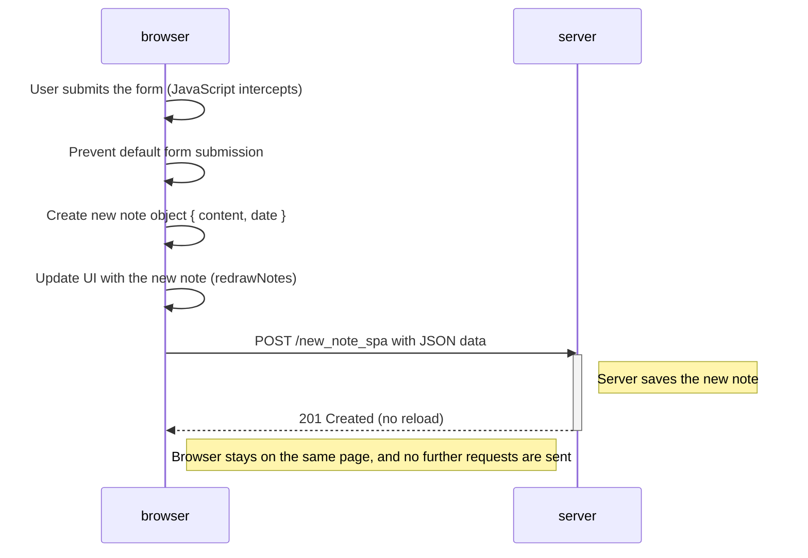

```mermaid
sequenceDiagram
    participant browser
    participant server

    browser->>browser: User submits the form (JavaScript intercepts)
    browser->>browser: Prevent default form submission
    browser->>browser: Create new note object { content, date }
    browser->>browser: Update UI with the new note (redrawNotes)

    browser->>server: POST /new_note_spa with JSON data
    activate server
    Note right of server: Server saves the new note
    server-->>browser: 201 Created (no reload)
    deactivate server

    Note right of browser: Browser stays on the same page, and no further requests are sent
```